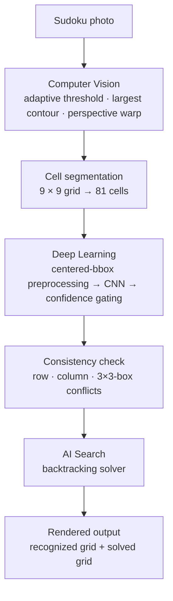

# 🧠 AI Sudoku Solver

End-to-end pipeline that takes a photo of a Sudoku puzzle and returns the solved grid. Combines computer vision (grid detection, perspective warp), deep learning (CNN digit recognition with confidence-thresholded acceptance), and classical AI search (backtracking with constraint propagation).


## Pipeline



## Why this is more than a tutorial

A naive approach (MNIST CNN + raw cell crops + greedy argmax) breaks on real photos. This project addresses three concrete failure modes that show up only when you actually run it:

**Centered-digit preprocessing.** MNIST is trained on digits centered on a 28×28 canvas with a fixed bounding box. Raw Sudoku cells have grid borders, off-center digits, and varying scales — so the CNN's accuracy collapses on them. The preprocessing pipeline finds the digit's bounding box via contour detection, rescales the larger dimension to 20 px (preserving aspect ratio), and pastes it centered on a 28×28 canvas. This recovers most of the lost accuracy.

**Dual-threshold confidence acceptance.** A single confidence cutoff is too brittle: too high and you reject correct digits with mediocre confidence, too low and you accept hallucinated digits in empty cells. The pipeline uses a strict threshold (0.90) for high-confidence acceptance and a borderline threshold (0.70) for fallback acceptance, with a separate empty-cell detector based on the white-pixel ratio.

**1-vs-7 disambiguation.** Empirically, the CNN's most common mistake is predicting `7` when the digit is `1` — especially on cells where the `1` has a serif. When the model's top prediction is `7` and `1` is the second-best with a confidence gap below 0.15, the prediction is flipped to `1`. This is a learned heuristic from observation, not from the CNN.

**Pre-solver consistency check.** Before invoking the backtracking solver, the recognized grid is validated for row/column/box conflicts. Without this, the solver wastes time on impossible inputs and fails opaquely; with it, the user gets a clear "the photo wasn't readable" error.

## Repository structure

```
AI-powered-Sudoku-solver/
├── app.py                     # Gradio app — production entry point
├── train_model.py             # CNN training script (MNIST + augmentation)
├── Sudoku_solver.ipynb        # development notebook (exploration + visualisations)
├── sudoku_model.keras         # trained CNN weights
├── requirements.txt
├── LICENSE                    # MIT
└── README.md
```

## Installation

```bash
git clone https://github.com/mehrtam/AI-powered-Sudoku-solver.git
cd AI-powered-Sudoku-solver
pip install -r requirements.txt
```

## Usage

### Run the Gradio app locally

```bash
python app.py
```

Opens a local web interface at `http://127.0.0.1:7860`. Upload a frontal, well-lit photo of a Sudoku puzzle.

### Retrain the digit recognizer

```bash
python train_model.py --output sudoku_model.keras
```

Trains a small CNN on MNIST with augmentation (rotation, zoom, width/height shift), early stopping on validation loss, and saves to `sudoku_model.keras`.

## Architecture

**Digit-recognition CNN:** `Conv(32) → MaxPool → Conv(64) → MaxPool → Flatten → Dense(128) → Dropout(0.3) → Dense(10, softmax)`. Trained on MNIST with rotation ±10°, zoom ±10%, width/height shifts ±10%. Adam optimizer, categorical cross-entropy loss, early stopping with patience 3.

**Solver:** Backtracking with constraint check on rows, columns, and 3×3 boxes. Recursive depth-first with restoration on failure.

## Tech stack

Python · OpenCV (CV pipeline) · TensorFlow / Keras (CNN) · NumPy · Gradio (web UI) · Hugging Face Spaces (deployment)

## Limitations

- Requires a frontal, well-lit photo with the full grid visible
- Heavy glare, severe perspective distortion, or partial crops reduce accuracy
- The CNN is trained on machine-typeset digits (MNIST style); hand-drawn puzzles may need fine-tuning

## Citation

If you use this work, please reference:

> Eslami, F. (2025). *AI-Powered Sudoku Solver: End-to-End CV + CNN + Backtracking* [Computer software]. https://github.com/mehrtam/AI-powered-Sudoku-solver

## Contact

**Fateme (Mehrta) Eslami** — University of Birmingham
[GitHub](https://github.com/mehrtam) · [LinkedIn](https://www.linkedin.com/in/fateme-eslami-014179219/) · [Live Demo](https://huggingface.co/spaces/mehrta/ai-sudoku-solver)

## License

MIT — see [LICENSE](LICENSE).
